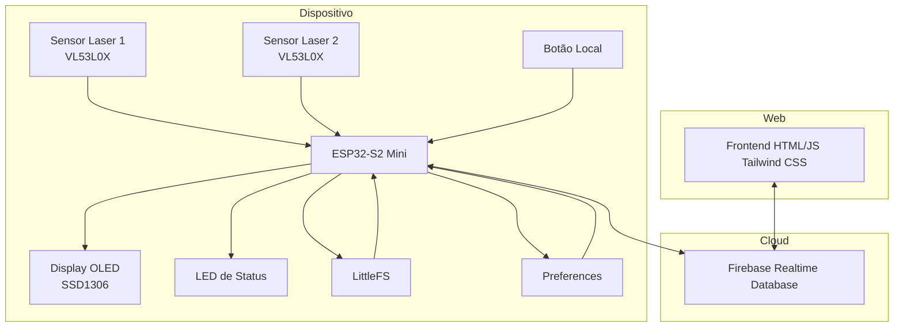
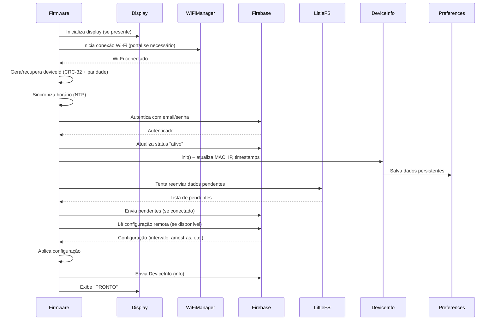
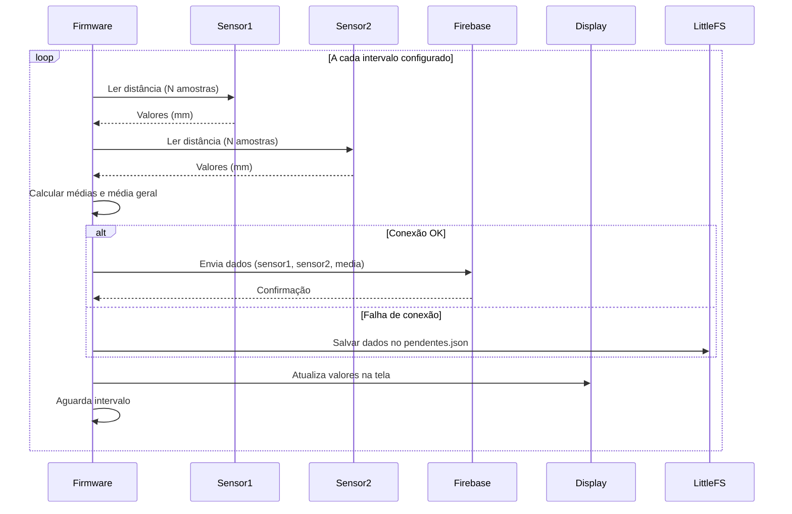
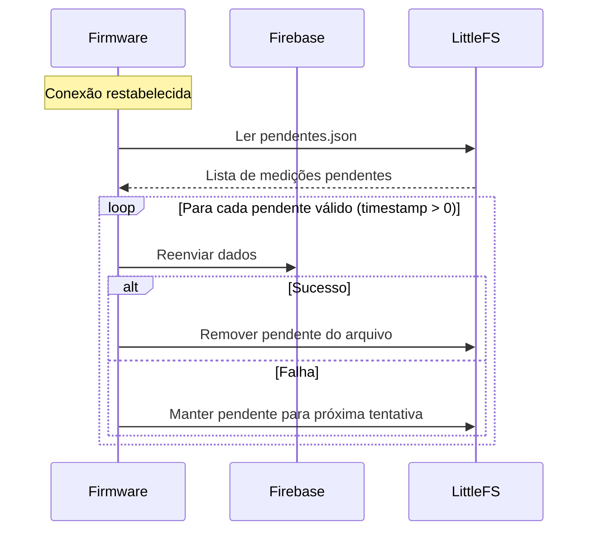
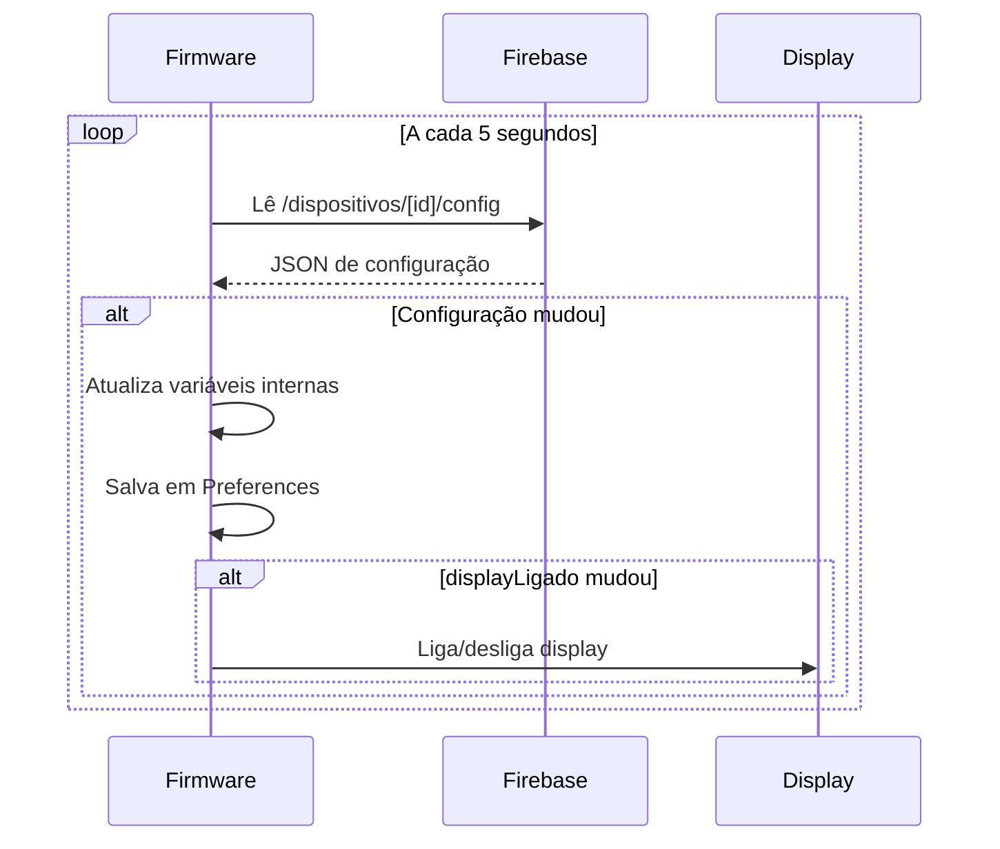
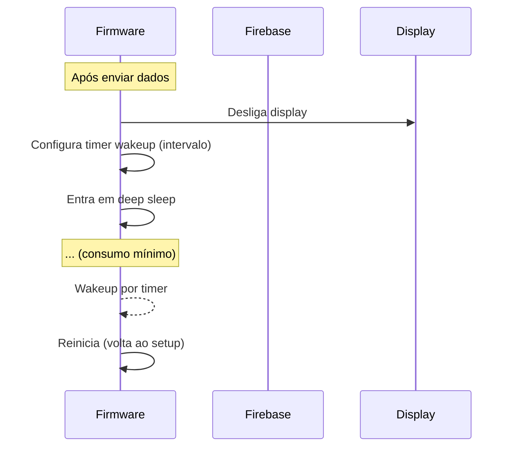
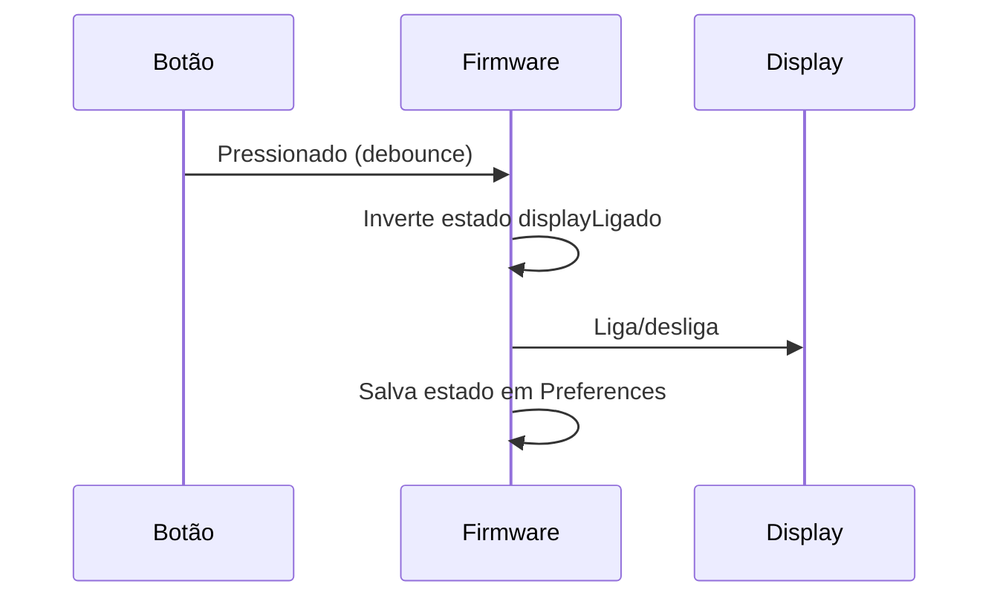
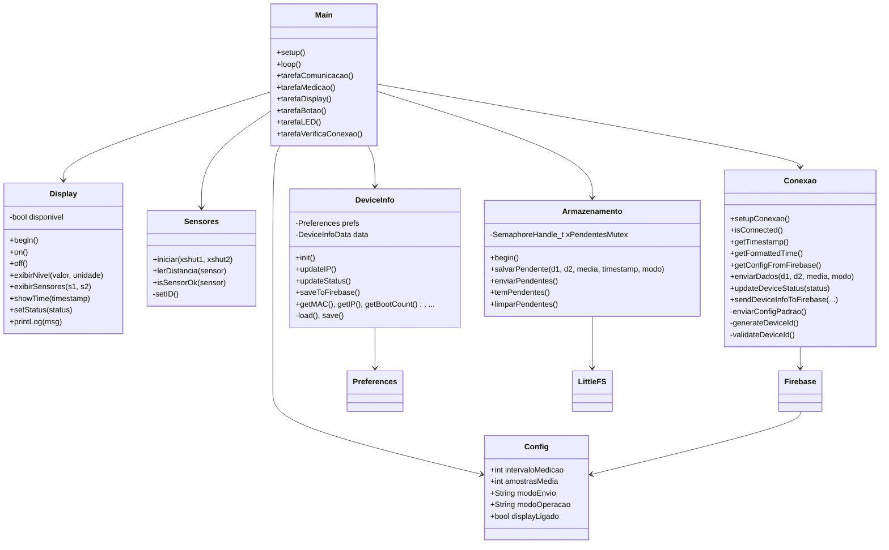

# Documentação do Projeto NivelTec – Monitoramento de Nível de Água (Versão Atualizada)

## 1. Introdução

O projeto **NivelTec** consiste em um sistema embarcado para monitoramento contínuo do nível de água em tanques evaporimétricos utilizando sensores laser de distância (VL53L0X). Os dados são enviados para um banco de dados em tempo real (Firebase Realtime Database), permitindo visualização remota e configuração de parâmetros operacionais. O sistema foi desenvolvido para operar com baixo consumo de energia, utilizando um ESP32-S2 Mini, display OLED, botão local, LED de status e modo de hibernação (deep sleep) configurável.

---

## 2. Objetivos

- Medir periodicamente a distância até a superfície da água utilizando dois sensores laser.
- Transmitir os dados (valores brutos e tratados) para a nuvem (Firebase).
- Permitir configuração remota de parâmetros (intervalo de medição, número de amostras, modo de envio, modo de operação e estado do display).
- Proporcionar interface local com display OLED, botão para ligar/desligar o display e LED para indicar estado de conexão.
- Economizar energia através de deep sleep quando configurado.
- Garantir a integridade dos dados através de armazenamento local em caso de falha de conexão (LittleFS).
- Registrar informações persistentes do dispositivo (MAC, IP, timestamps de inicialização, contador de boots, versão do firmware) para diagnóstico e histórico.

---

## 3. Arquitetura Geral

O sistema é composto por três camadas principais:

1. **Firmware** – código executado no ESP32-S2 Mini, responsável por ler sensores, controlar periféricos e comunicar-se com o Firebase.
2. **Firebase** – plataforma na nuvem que armazena dados e parâmetros de configuração.
3. **Aplicação Web** – interface responsiva que permite ao usuário visualizar dados, gerenciar dispositivos e editar configurações.



---

## 4. Firmware (ESP32-S2 Mini)

### 4.1 Hardware e Pinos

| Componente        | Pino(s)                  | Descrição                               |
|-------------------|--------------------------|-----------------------------------------|
| LED de status     | GPIO15                   | Indica estado de conexão                |
| Botão local       | GPIO0                    | Liga/desliga display (pull‑up interno)  |
| I2C (SDA/SCL)     | GPIO33, GPIO35           | Comunicação com sensores e display      |
| XSHUT Sensor 1    | GPIO39                    | Reset do primeiro VL53L0X               |
| XSHUT Sensor 2    | GPIO37                    | Reset do segundo VL53L0X                |
| Display OLED      | I2C (0x3C)               | SSD1306, 128×64                         |
| Sensores laser    | I2C (0x30 e 0x31)        | VL53L0X com endereços personalizados    |

### 4.2 Principais Funcionalidades

- **Inicialização**: WiFiManager padrão para configuração da rede; sincronização NTP (UTC‑3); autenticação no Firebase.
- **Identificador do dispositivo (deviceId)**: Gerado a partir do MAC via CRC‑32 com 4 bits de paridade → 9 caracteres hex (ex: `A1B2C3D4E`). O ID é armazenado em `Preferences` e utilizado como chave no banco.
- **Leitura dos sensores**: Dois sensores VL53L0X com endereços 0x30 e 0x31. A média das leituras (após filtragem básica) é calculada e enviada ao Firebase.
- **Configuração remota**: A cada 5 segundos, o firmware lê o nó `/dispositivos/[deviceId]/config` e atualiza parâmetros internos (intervalo, amostras, modo de envio, modo de operação, estado do display).
- **Armazenamento local (LittleFS)**: Quando o envio falha, os dados são salvos em `/pendentes.json` (formato JSON array). Ao reconectar, são automaticamente reenviados. Pendentes com timestamp inválido (0) são descartados.
- **Informações persistentes do dispositivo**: Classe `DeviceInfo` armazena em `Preferences` MAC, IP, timestamps de primeira/última inicialização, contador de boots e versão do firmware. Esses dados são enviados ao Firebase no nó `/info`.
- **Modo de operação**:
  - `sempreAtivo`: o sistema aguarda o intervalo entre medições usando `vTaskDelay`.
  - `hibernar`: após enviar os dados, o ESP entra em deep sleep por `intervalo` segundos, desligando display e Wi‑Fi.
- **Tarefas FreeRTOS**: Múltiplas tarefas executam em paralelo (comunicação, medição, display, botão, LED, verificação de reconexão). Mutexes protegem acesso ao barramento I2C e à estrutura de configuração.

### 4.3 Bibliotecas Utilizadas

| Biblioteca                     | Finalidade                                |
|--------------------------------|-------------------------------------------|
| `WiFiManager` (2.0.17)         | Configuração Wi‑Fi com portal captivo     |
| `Firebase_ESP_Client` (4.4.0)  | Comunicação com Firebase Realtime DB      |
| `NTPClient` (3.2.0)            | Sincronização de horário                   |
| `Adafruit_VL53L0X` (1.3.0)     | Leitura dos sensores laser                |
| `Adafruit_SSD1306` (2.5.13)    | Controle do display OLED                  |
| `Preferences` (embutida)       | Armazenamento persistente de configurações|
| `LittleFS` (embutida)          | Sistema de arquivos para dados pendentes  |
| `ArduinoJson` (6.21.5)         | Manipulação de JSON para pendentes        |
| `CRC32` (opcional)             | Cálculo do CRC‑32 para geração do deviceId|

---

## 5. Banco de Dados (Firebase Realtime Database)

### 5.1 Estrutura de Dados

```json
{
  "dispositivos": {
    "[deviceId]": {
      "estado": "ativo",
      "ultimaLeitura": 1774906209,
      "info": {
        "mac": "CC:8D:A2:88:B2:08",
        "ip": "192.168.1.104",
        "firstBoot": 1774906209,
        "lastBoot": 1774983041,
        "bootCount": 28,
        "firmwareVersion": "1.0.0",
        "status": "ativo",
        "lastUpdate": 1774983041
      },
      "config": {
        "intervaloMedicao": 600,
        "amostrasMedia": 5,
        "modoEnvio": "ambos",
        "modoOperacao": "sempreAtivo",
        "displayLigado": true
      },
      "medicoes": {
        "1774906210": {
          "sensor1_dist": 450,
          "sensor2_dist": 455,
          "media": 452.5,
          "timestamp": 1774906210
        }
      }
    }
  },
  "users": {
    "[uid]": {
      "nome": "João",
      "email": "joao@email.com",
      "createdAt": 1774906209,
      "dispositivos": {
        "[deviceId]": {
          "apelido": "Tanque Norte",
          "timestamp": 1774906209
        }
      }
    }
  },
  "admins": {
    "[uid]": true
  }
}
```

### 5.2 Regras de Segurança

```json
{
  "rules": {
    "users": {
      "$uid": {
        ".read": "$uid === auth.uid",
        ".write": "$uid === auth.uid",
        "dispositivos": {
          "$deviceId": {
            ".read": "$uid === auth.uid",
            ".write": "$uid === auth.uid"
          }
        }
      }
    },
    "dispositivos": {
      "$deviceId": {
        ".read": "auth != null",
        ".write": "auth != null",
        "info": { ".read": true, ".write": false },
        "estado": { ".read": true, ".write": "auth != null" },
        "ultimaLeitura": { ".read": true, ".write": "auth != null" },
        "config": {
          ".read": true,
          ".write": "root.child('admins').child(auth.uid).val() === true"
        },
        "medicoes": {
          ".read": true,
          ".write": "auth != null",
          "$timestamp": {
            ".validate": "newData.hasChildren(['sensor1_dist', 'sensor2_dist', 'media', 'timestamp'])"
          }
        }
      }
    },
    "admins": {
      "$uid": {
        ".read": false,
        ".write": false,
        ".validate": "newData.isBoolean() && newData.val() === true"
      }
    }
  }
}
```

**Explicação das regras**:
- Cada usuário só pode ler/escrever seus próprios dados no nó `users`.
- Qualquer usuário autenticado pode ler informações básicas dos dispositivos (`estado`, `ultimaLeitura`, `medicoes`) e criar novas medições.
- Apenas administradores (UID listados em `admins`) podem alterar a configuração (`config`).
- O nó `info` é somente leitura para todos, para preservar o histórico do dispositivo.

---

## 6. Fluxos Principais (Atualizado)

### 6.1 Inicialização do Sistema



### 6.2 Ciclo de Medição (Modo Sempre Ativo)



### 6.3 Recuperação de Dados Pendentes



### 6.4 Leitura de Configuração Remota



### 6.5 Modo Hibernação (Deep Sleep)



### 6.6 Interação com Botão




---

## 7. Aplicação Web (Frontend)

### 7.1 Estrutura de Páginas

| Página                | Rota               | Funcionalidade                                                                 |
|-----------------------|--------------------|--------------------------------------------------------------------------------|
| Login                 | `login.html`       | Autenticação com email/senha ou Google; tratamento de parâmetro `?device=`      |
| Cadastro              | `cadastro.html`    | Criação de nova conta; associação automática de dispositivo, se presente       |
| Adicionar Dispositivo | `cadastro-dispositivo.html` | Leitura de código (digitação ou QR Code) e associação ao usuário         |
| Meus Dispositivos     | `dispositivos.html`| Lista todos os dispositivos do usuário; permite renomear, remover e acessar    |
| Dashboard             | `index.html`       | Exibe última medição (sensor1, sensor2, média) e informações do dispositivo    |
| Tabela e Gráficos     | `tabela.html`      | Histórico completo de medições em tabela e gráfico de evolução do nível        |
| Configurações         | `configuracoes.html`| Permite editar parâmetros do dispositivo (apenas para administradores)        |
|            GerarQRcode           |           gerarqrcode.html          |                                        permite criar um qrcode para adcinar o dispositivo de forma mais facil ao usuario (Falta testar)                                       |

> **Nota:** Não existe página separada para gráficos; a funcionalidade gráfica foi incorporada na página de tabela (`tabela.html`), que apresenta tanto a tabela quanto um gráfico de linha (Sensor 1, Sensor 2 e Média) para visualização da evolução temporal.

### 7.2 Funcionalidades Comuns

- **Autenticação**: Todos os acessos exigem login. Redirecionamento automático para login se usuário não autenticado.
- **Parâmetro `device` na URL**: Mantém o contexto do dispositivo selecionado, passado entre páginas.
- **Atualização em tempo real**: Uso de listeners do Firebase (`on('value')`) para refletir alterações instantâneas.
- **Formatação de data/hora**: Os timestamps Unix (segundos) são convertidos para UTC usando `new Date(timestamp * 1000).toLocaleString('pt-BR', { timeZone: 'UTC' })` para exibição correta.
- **Exportação CSV**: Geração de arquivo com cabeçalho e dados no formato adequado (ponto e vírgula como delimitador, encoding UTF‑8 com BOM).

### 7.3 Estilo e Responsividade

- Utiliza **Tailwind CSS** para layout responsivo.
- Cores principais: verde (#14532d) e azul (#1e3a8a) com gradiente.
- Ícones: Font Awesome 6.

---

## 8. Diagrama de Classes 



---


## 9. Decisões Técnicas Importantes

### 9.1 Uso do WiFiManager Padrão

Optou-se pelo `WiFiManager` tradicional (síncrono) em vez da versão assíncrona devido a:

- **Menor complexidade de instalação** – todas as dependências estão disponíveis no Library Manager.
- **Consumo de recursos** – a versão síncrona consome menos flash e RAM, deixando mais espaço para o código de aplicação e para futuras implementações como OTA.
- **Confiabilidade** – funciona de forma estável no ESP32-S2.
- **Raridade de uso** – o portal de configuração só é acionado na primeira inicialização ou quando não há credenciais salvas.

### 9.2 Geração do DeviceId

O identificador do dispositivo é gerado a partir do MAC via CRC‑32 (32 bits) + 4 bits de paridade (XOR dos bytes do CRC). Resultado: 9 caracteres hex. Vantagens:
- Ofusca o MAC original (não exposto no banco).
- Permite detecção de erros de digitação no frontend.
- Determinístico (mesmo ID para o mesmo hardware).

### 9.3 Uso de Dois Sensores VL53L0X

Permite redundância e fusão de dados, reduzindo erros causados por ondulações ou obstruções.

### 9.4 Persistência de Configuração

As configurações são salvas em **Preferences** (NVS) para sobreviver a resets e deep sleep. A sincronização com o Firebase garante que alterações remotas sejam aplicadas e persistidas localmente.

### 9.5 Armazenamento Local de Pendentes (LittleFS)

Utiliza LittleFS para persistir dados quando o envio falha. Os dados são armazenados em um array JSON (`/pendentes.json`), garantindo que nenhuma medição seja perdida durante interrupções de rede. A classe `Armazenamento` gerencia a gravação e a retransmissão automática assim que a conexão é restabelecida. Pendentes com timestamp 0 (corrompidos) são ignorados.

### 9.6 Informações Persistentes do Dispositivo (DeviceInfo)

A classe `DeviceInfo` armazena em Preferences dados como MAC, IP, timestamps de primeira e última inicialização, contador de boots, versão do firmware e status atual. Essas informações são enviadas ao Firebase no nó `/info` e são úteis para diagnóstico, rastreamento de reinicializações e identificação de dispositivos.

### 9.7 Deep Sleep

Para economia de energia, o modo de hibernação coloca o ESP32-S2 em deep sleep entre medições, desligando o display e Wi-Fi. O despertar é feito por timer, e o sistema reinicia completamente. As configurações são mantidas em NVS.

### 9.8 Formatação de Datas no Web App

Os timestamps armazenados no Firebase estão em segundos (Unix UTC). No frontend, a conversão é feita com `new Date(timestamp * 1000)` e exibida em UTC com `toLocaleString('pt-BR', { timeZone: 'UTC' })`. Isso garante que a hora mostrada corresponda exatamente à hora do evento, sem deslocamento de fuso.

---

## 10. Status Atual e Próximos Passos

### 10.1 Concluído

- Leitura dos dois sensores laser com inicialização robusta (endereços 0x30 e 0x31) e proteção I2C com mutex.
- Comunicação com Firebase (autenticação, envio de dados, leitura de configuração, criação automática da configuração padrão).
- Display OLED com exibição de nível (fonte grande), valores dos sensores, hora e status de conexão. Tratamento de falha do display (sistema continua sem display).
- Botão local para ligar/desligar display.
- LED indicador de conexão (pisca lento quando conectado, rápido quando desconectado).
- Modo sempre ativo e modo hibernação com deep sleep.
- WiFiManager padrão para configuração inicial da rede.
- **Armazenamento local de dados pendentes** – quando a conexão falha, as medições são salvas em LittleFS (`/pendentes.json`). Ao reconectar, são reenviadas automaticamente.
- **Informações persistentes do dispositivo** – `DeviceInfo` armazena MAC, IP, timestamps de primeira/última inicialização, contador de boots, versão do firmware e status, e envia ao Firebase no nó `/info`.
- **Proteção do barramento I2C** com mutex para evitar conflitos entre display e sensores.
- **Detecção de reconexão e reenvio de pendentes**.
- **Web App completo**: login, cadastro, gerenciamento de dispositivos, dashboard, tabela com gráfico integrado e página de configurações (apenas administradores).
- **Regras de segurança do Firebase** configuradas com separação de administradores.

### 10.2 Pendente / Próximos Passos

- **Redução do tamanho do firmware para permitir OTA**:
  - Substituir WiFiManager pela versão Lite (`ESPAsync_WiFiManager_Lite`) ou implementar portal manual simplificado.
  - Otimizar compilação (remover logs desnecessários, usar opções de tamanho).
  - Utilizar esquema de partições com OTA.
- **Implementar OTA (Over‑The‑Air)**:
  - Adicionar verificação periódica por atualizações (via Firebase Storage ou servidor HTTP).
  - Utilizar a classe `Update` para gravar o novo firmware.
- **Filtragem mais robusta** (mediana, filtro de Kalman) para os dados dos sensores.
- **Envio de amostras brutas** (array) quando configurado.
- **Testes de integridade dos sensores** (ex.: detecção de falhas).
- **Melhorias no Web App**:
  - Permitir que administradores gerenciem outros usuários.
  - Notificações push (FCM) para alertas de nível crítico.
  - Visualização comparativa de múltiplos dispositivos.

---

## 11. Conclusão

O projeto NivelTec atende aos requisitos de monitoramento remoto do nível de água com baixo consumo energético. A arquitetura modular facilitou a inclusão de funcionalidades avançadas como **armazenamento local de dados pendentes** e **informações persistentes do dispositivo**, garantindo que nenhuma medição seja perdida e permitindo rastreamento completo do histórico do dispositivo. A aplicação web oferece uma interface intuitiva e responsiva, com suporte a gráficos e exportação de dados.

As próximas etapas focam na otimização do firmware para permitir atualizações OTA, garantindo que o sistema possa ser mantido e melhorado remotamente, sem necessidade de acesso físico ao hardware.

---
**Data da última atualização:** 31 de março de 2026  
**Versão do firmware:** 1.0.0  
**Versão do web app:** 1.0.0
```
