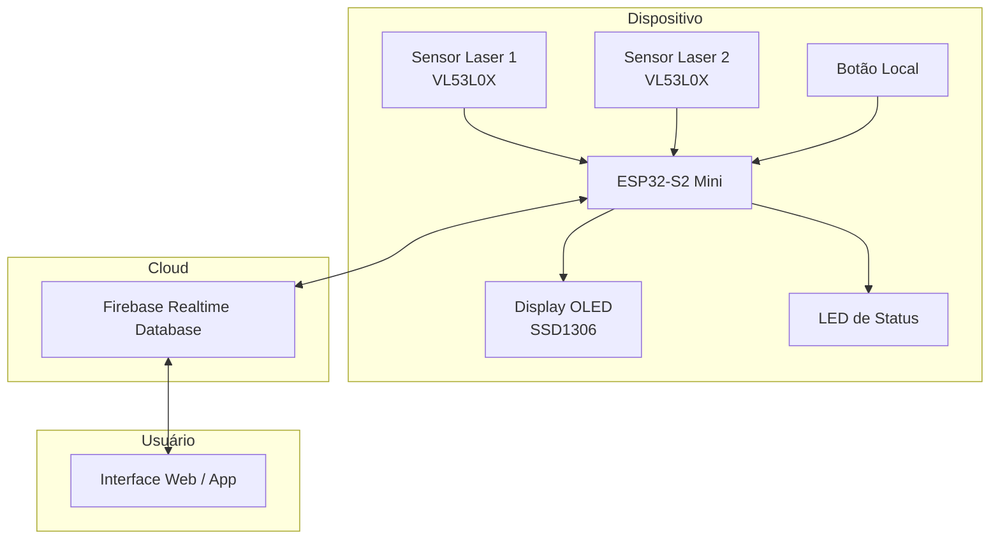
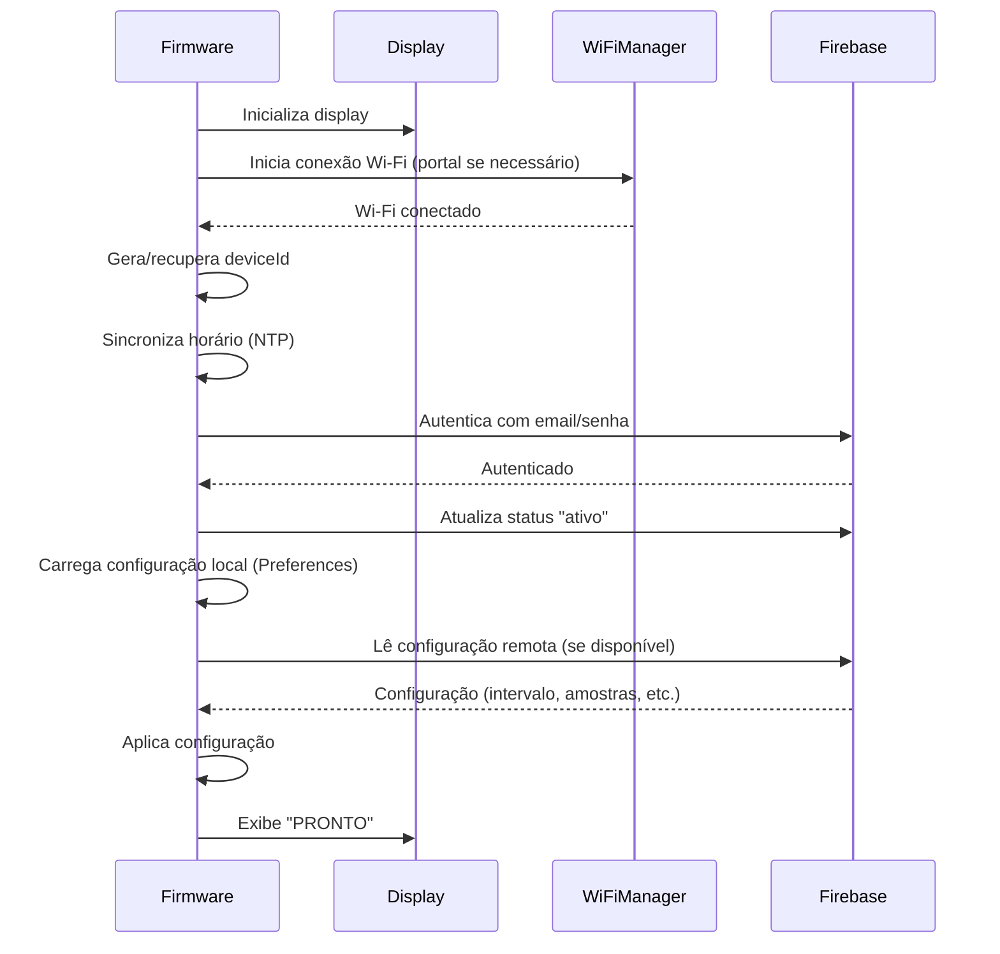
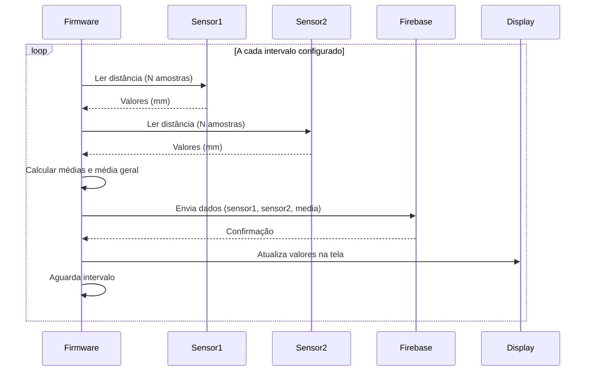
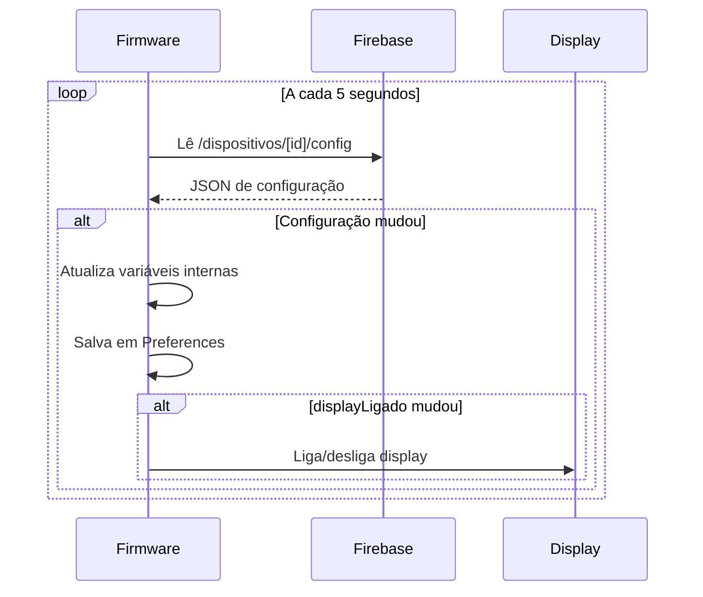
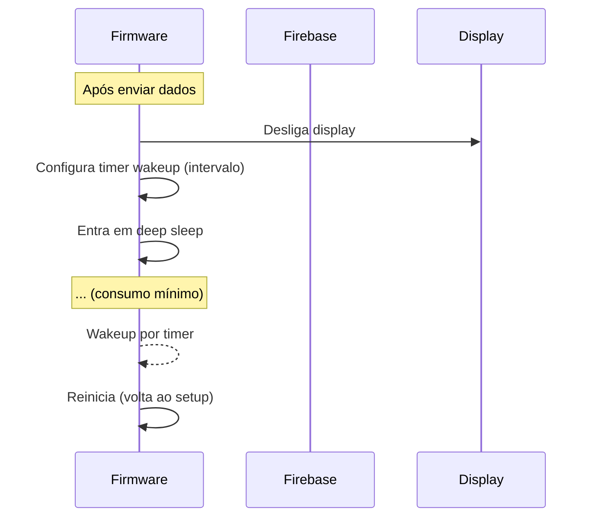
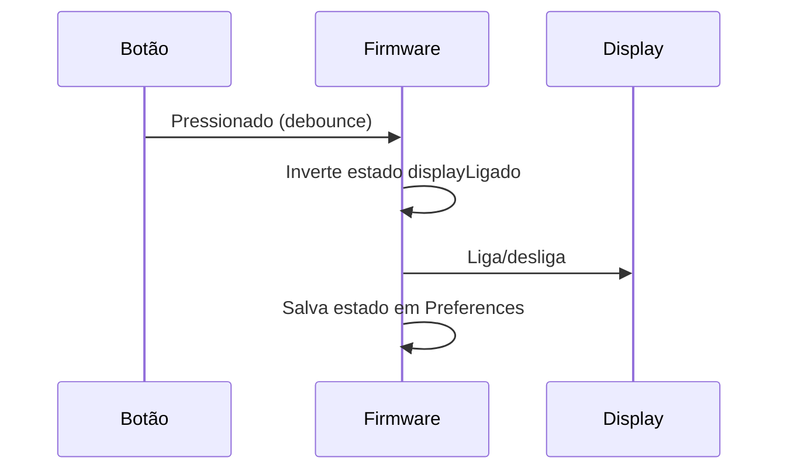
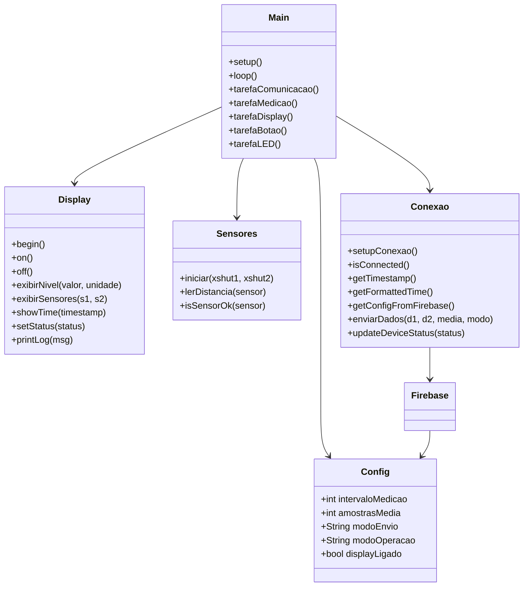

# Documentação do Projeto NivelTec – Monitoramento de Nível de Água

## 1. Introdução

O projeto **NivelTec** consiste em um sistema embarcado para monitoramento contínuo do nível de água em tanques evaporimétricos utilizando sensores laser de distância (VL53L0X). Os dados são enviados para um banco de dados em tempo real (Firebase Realtime Database), permitindo visualização remota e configuração de parâmetros operacionais. O sistema foi desenvolvido para operar com baixo consumo de energia, utilizando um ESP32-S2 Mini, display OLED, botão local, LED de status e modo de hibernação (deep sleep) configurável.

## 2. Objetivos

- Medir periodicamente a distância até a superfície da água utilizando dois sensores laser.
- Transmitir os dados (valores brutos e tratados) para a nuvem (Firebase).
- Permitir configuração remota de parâmetros (intervalo de medição, número de amostras, modo de envio, modo de operação e estado do display).
- Proporcionar interface local com display OLED, botão para ligar/desligar o display e LED para indicar estado de conexão.
- Economizar energia através de deep sleep quando configurado.

## 3. Arquitetura Geral

O sistema é composto por três camadas principais:

1. **Firmware** – código executado no ESP32-S2 Mini, responsável por ler sensores, controlar periféricos e comunicar-se com o Firebase.
2. **Firebase** – plataforma na nuvem que armazena dados e parâmetros de configuração.
3. **Usuário** – pode acessar os dados via web ou aplicativo (não implementado neste escopo).



## 4. Hardware

| Componente | Modelo | Função |
|------------|--------|--------|
| Microcontrolador | ESP32-S2 Mini | Processador principal, Wi-Fi, I2C, GPIO |
| Sensor Laser 1 | VL53L0X | Mede distância (time-of-flight) |
| Sensor Laser 2 | VL53L0X | Segundo sensor para redundância/fusão |
| Display OLED | 0.96" SSD1306 (I2C) | Interface local (nível, hora, status) |
| Botão | Tato (GPIO0) | Liga/desliga display |
| LED | GPIO2 | Indica estado de conexão |

## 5. Estrutura de Dados no Firebase

Os dados são organizados sob o nó `/dispositivos/[deviceId]`, onde `deviceId` é o endereço MAC sem dois pontos (ex.: `A1B2C3D4E5F6`).

```json
{
  "dispositivos": {
    "[deviceId]": {
      "estado": "ativo",
      "ultimaLeitura": 1678901234,
      "config": {
        "intervaloMedicao": 600,
        "amostrasMedia": 5,
        "modoEnvio": "ambos",
        "modoOperacao": "sempreAtivo",
        "displayLigado": true
      },
      "medicoes": {
        "[timestamp]": {
          "sensor1_dist": 450,
          "sensor2_dist": 455,
          "media": 452.5,
          "timestamp": 1678901234
        }
      }
    }
  }
}
```

**Campos:**
- `estado`: `ativo` / `inativo` / `erro`
- `ultimaLeitura`: timestamp Unix da última medição
- `config`: parâmetros operacionais (podem ser alterados remotamente)
- `medicoes`: registro histórico de medições

## 6. Fluxos Principais

### 6.1 Inicialização do Sistema



### 6.2 Ciclo de Medição (Modo Sempre Ativo)



### 6.3 Leitura de Configuração Remota



### 6.4 Modo Hibernação (Deep Sleep)



### 6.5 Interação com Botão



## 7. Bibliotecas Utilizadas

| Biblioteca | Versão | Finalidade |
|------------|--------|------------|
| `WiFiManager` | 2.0.17 | Gerenciamento de Wi-Fi com portal captivo |
| `Firebase_ESP_Client` | 4.4.0 | Comunicação com Firebase Realtime Database |
| `NTPClient` | 3.2.0 | Sincronização de horário via NTP |
| `Adafruit_VL53L0X` | 1.3.0 | Leitura dos sensores laser |
| `Adafruit_SSD1306` | 2.5.13 | Controle do display OLED |
| `Preferences` | (embutida) | Armazenamento persistente de configurações |

## 8. Decisões Técnicas Importantes

### 8.1 Uso do WiFiManager Padrão

Optou-se pelo `WiFiManager` tradicional (síncrono) em vez da versão assíncrona devido a:

- **Menor complexidade de instalação** – todas as dependências estão disponíveis no Library Manager do Arduino IDE.
- **Consumo de recursos** – a versão síncrona consome menos flash e RAM, deixando mais espaço para o código de aplicação e para futuras implementações como OTA.
- **Confiabilidade** – funciona de forma estável no ESP32-S2, sem problemas de compatibilidade com cadeias de dependências (como `ESPAsyncDNSServer` e `ESPAsyncUDP`).
- **Raridade de uso** – o portal de configuração só é acionado na primeira inicialização ou quando não há credenciais salvas; durante a operação normal o sistema não fica bloqueado.

### 8.2 Uso de Dois Sensores VL53L0X

A escolha por dois sensores permite:
- Redundância: caso um sensor falhe, o outro ainda fornece dados.
- Fusão de dados: a média dos dois sensores reduz erros devido a ondulações na superfície ou obstruções parciais.

### 8.3 Persistência de Configuração

As configurações são salvas em **Preferences** (NVS) para sobreviver a resets e deep sleep. A sincronização com o Firebase garante que alterações remotas sejam aplicadas e também persistidas localmente.

### 8.4 Deep Sleep

Para economia de energia, o modo de hibernação coloca o ESP32-S2 em deep sleep entre medições, desligando o display e Wi-Fi. O despertar é feito por timer, e o sistema reinicia completamente. As configurações são mantidas em NVS.

## 9. Status Atual

- **Concluído:** 
  - Leitura dos dois sensores laser com inicialização individual via XSHUT.
  - Comunicação com Firebase (autenticação, envio de dados, leitura de configuração).
  - Display OLED com exibição de nível (fonte grande), valores dos sensores, hora e status de conexão.
  - Botão local para ligar/desligar display.
  - LED indicador de conexão (pisca lento quando conectado, rápido quando desconectado).
  - Modo de operação sempre ativo.
  - Modo hibernação com deep sleep (desligando display e Wi-Fi).
  - WiFiManager padrão para configuração inicial da rede.

- **Pendente / Próximos Passos:**
  - Implementar filtragem mais robusta (mediana, filtro de Kalman) para os dados dos sensores.
  - Implementar envio de amostras brutas (array) quando configurado.
  - Adicionar suporte a OTA (over-the-air updates).
  - Implementar testes de integridade dos sensores (ex.: detecção de falhas).
  - Desenvolver interface web/app para visualização dos dados.

## 10. Diagrama de Classes (Esboço)



## 11. Conclusão

O projeto NivelTec atende aos requisitos iniciais de monitoramento remoto do nível de água com baixo consumo energético. A escolha do WiFiManager padrão trouxe simplicidade e confiabilidade para o sistema, mantendo a capacidade de configuração inicial fácil. A arquitetura modular facilita manutenção e evolução futura, incluindo a adição de novas funcionalidades como OTA e processamento avançado de dados.

---
